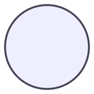
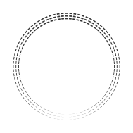

# NimSvg  [](https://github.com/bluenote10/NimSvg/actions?query=workflow%3Aci)

Nim-based DSL allowing to generate SVG files and GIF animations.

## DSL

NimSvg is inspired by [Karax](https://github.com/pragmagic/karax), and offers a similar DSL to generate SVG trees.
A simple hello world

```nim
import nimsvg

buildSvgFile("examples/basic1.svg"):
  svg(width=200, height=200):
    circle(cx=100, cy=100, r=80, stroke="teal", `stroke-width`=4, fill="#DDD")
```

produces the following SVG:

```svg
<?xml version="1.0" encoding="UTF-8" ?>
<!DOCTYPE svg PUBLIC "-//W3C//DTD SVG 1.1//EN" "http://www.w3.org/Graphics/SVG/1.1/DTD/svg11.dtd">
<svg width="200" height="200">
  <circle cx="100" cy="100" r="80" stroke="teal" stroke-width="4" fill="#DDD"/>
</svg>
```

Output:


The DSL allows to mix tag expressions with regular Nim expressions like variable definitions, for loops, or if statements,
which makes it easy to generate SVGs programmatically:

```nim
import nimsvg, random

buildSvgFile("random_circles.svg"):
  let size = 200
  svg(width=size, height=size):
    for _ in 0 .. 1000:
      let x = rand(size)
      let y = rand(size)
      let radius = rand(5)
      circle(cx=x, cy=y, r=radius, stroke="#111122", fill="#E0E0F0", `fill-opacity`=0.5)
```

Output:


NimSvg also allows to render a sequence of SVG files into an animated GIF (requires Imagemagick for the rendering):

```nim
import nimsvg

let settings = animSettings("filenameBase", backAndForth=true)
let numFrames = 100

settings.buildAnimation(numFrames) do (i: int) -> Nodes:
  let w = 200
  let h = 200
  buildSvg:
    svg(width=w, height=h):
      let r = 0.4 * w.float * i.float / settings.numFrames.float + 10
      circle(cx=w/2, cy=h/2, r=r, stroke="#445", `stroke-width`=4, fill="#EEF")
```

Output:

[](examples/animation1.nim)

### Special syntax

- `t`: The `t` keyword can be used to create text nodes:
  ```nim
  let svg = buildSvg:
    text(x=0, y=0):
      t "Hello World"
  ```


- `embed`: The embed keyword can be used to embed the result of other nodes.
  ```nim
  proc sub(): Nodes = buildSvg:
    b()
    c()

  let svg = buildSvg:
    # produces tags <a><b><c><d>
    a()
    embed sub()
    d()
  ```

## Gallery

Click on an image to see the corresponding implementation.

| | | |
:-------------------------:|:-------------------------:|:-------------------------:
[](examples/spinner1.nim)  |  [](examples/spinner2.nim)   | [](examples/spinner3.nim)
